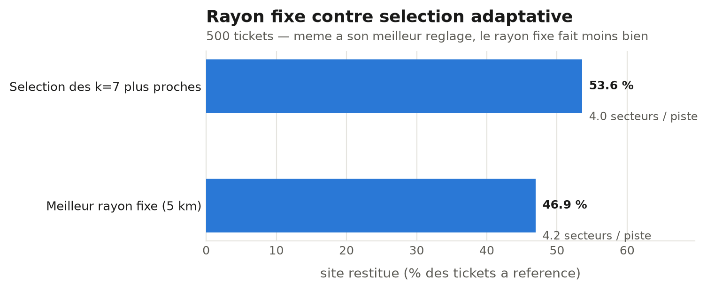
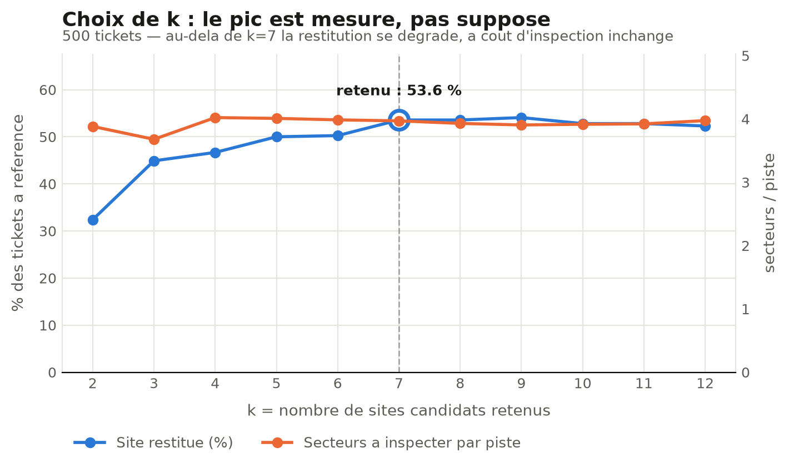

# RAN AIOps Pipeline

End-to-end AIOps prototype for radio access network operations: detect KPI
anomalies, correlate them with customer complaints, and generate
engineer-facing recommendations.

The system is intentionally human-in-the-loop. The pipeline computes anomaly
signals, candidate nodes, KPI context, and RAG evidence; the engineer decides
when to process a ticket and whether to validate the recommendation.

## Highlights

- Unsupervised EN-DC KPI anomaly detection with ECOD.
- Chronic-cell and daily-incident outputs.
- SQLite ticket store with `recu -> en_cours -> traite/echec` statuses.
- Streamlit console for ticket intake, processing, recommendations, and engineer validation.
- Governorate -> delegation dropdowns for Tunisia.
- RAG recommendations grounded in local KPI/family Markdown notes.
- Public demo seed data so Docker runs are not empty.
- Two Docker profiles: lightweight app image and full ML/offline image.
- Explicit anonymisation workflow for private node names.

## Architecture

```text
KPI CSV
  -> robust regional z-scores
  -> ECOD anomaly scoring
  -> daily anomalies + chronic cells

Customer complaint
  -> SQLite ticket
  -> Gemini classification
  -> geocoding / governorate fallback
  -> anomaly matching
  -> deterministic retrieval from base_connaissance/
  -> LLM recommendation
  -> engineer validation
```

## Results

These results come from the local anonymized evaluation artifacts in
`resultats/`. They are not committed because generated outputs are ignored, but
the numbers below document the latest run.

| Component | Result |
|---|---:|
| Daily anomaly rows | 2,539 |
| Anonymized nodes with daily anomalies | 217 |
| Cells with daily anomalies | 716 |
| Regions represented | 13 |
| Chronic cells | 63 |
| Synthetic tickets evaluated for classification | 446 |
| Embedding classifier accuracy | 79.4% |
| LLM classifier accuracy | 96.6% |

Recommendation evaluation, averaged over a small A/B sample of 10 generated
answers, scored from 1 to 10:

| Variant | Context | Triage utility | Knowledge grounding | Prudence | Pipeline coherence |
|---|---:|---:|---:|---:|---:|
| With RAG | 7.8 | 9.0 | 9.8 | 9.8 | 9.6 |
| Without RAG | 7.8 | 8.2 | 7.6 | 8.2 | 8.8 |

Matching evaluation on 500 synthetic tickets:





## Method Notes

**Anomaly detection.** The detector treats one row as one cell-day. KPI values
are converted to robust regional z-scores using median and MAD, then scaled and
scored with PyOD ECOD at 3% contamination. ECOD was chosen because it is
unsupervised, stable on tabular KPI data, and exposes per-dimension scores that
are reused to explain which KPI contributed most to an anomaly.

**Chronic cells.** A cell is marked chronic when it has enough history and is
flagged anomalous on at least 50% of its observed days. Short-history cells are
written separately so they do not pollute chronic-cell analysis.

**Deterministic RAG.** Retrieval is deterministic because the system maps KPI
names and KPI families directly to local Markdown files in `base_connaissance/`.
There is no vector search randomness: the same KPI list selects the same files.
The LLM receives the ticket context plus those selected notes and generates the
recommendation.

**Gemini dependency.** The project uses the Gemini HTTP API via
`gemini-flash-lite-latest`. Calls are cached by prompt hash and retried with
backoff for temporary quota/network failures. Set `GEMINI_API_KEY` in `.env`.

## Quick Start With Docker

Build and run the lightweight Streamlit app image:

```bash
docker build -t ran-aiops-app -f Dockerfile .
docker run --rm -p 8501:8501 ran-aiops-app
```

Open:

```text
http://localhost:8501
```

The public image seeds fake demo data on first run if no real runtime files are
present. To run with an API key:

```bash
docker run --rm -p 8501:8501 --env-file .env ran-aiops-app
```

To use your own anonymized runtime data:

```bash
docker run --rm -p 8501:8501 \
  --env-file .env \
  -v "$(pwd)/data:/app/data" \
  -v "$(pwd)/resultats:/app/resultats" \
  -v "$(pwd)/reclamations.db:/app/reclamations.db" \
  ran-aiops-app
```

Disable demo seeding:

```bash
docker run --rm -p 8501:8501 -e RAN_AIOPS_DEMO=0 ran-aiops-app
```

## Docker Profiles

| File | Dependency file | Purpose |
|---|---|---|
| `Dockerfile` | `requirements-app.txt` | Fast Streamlit app and online ticket flow |
| `Dockerfile.full` | `requirements.txt` | Full offline ML pipeline and experiments |

Build the full image only when you need offline scripts such as anomaly
detection, embeddings, plots, or evaluations:

```bash
docker build -t ran-aiops-full -f Dockerfile.full .
```

The full image installs `sentence-transformers` and Torch dependencies, so it is
much slower and larger than the app image.

## Local Installation

Full environment:

```bash
python -m venv venv
source venv/bin/activate
pip install -r requirements.txt
```

Windows activation:

```bash
venv\Scripts\activate
```

App-only environment:

```bash
pip install -r requirements-app.txt
```

Create `.env`:

```text
GEMINI_API_KEY=your_key_here
```

Run the app:

```bash
streamlit run app_streamlit.py
```

## Operating Tickets

Create a ticket from the Streamlit form, or from CLI:

```bash
python -m ran_aiops.reclamations.traitement \
  --texte "la connexion coupe souvent" \
  --date 2026-06-25 \
  --gouvernorat Gabes
```

Process pending tickets:

```bash
python -m ran_aiops.reclamations.traitement --en-attente
```

Create and process immediately:

```bash
python -m ran_aiops.reclamations.traitement \
  --texte "la 5G est tres lente depuis ce matin" \
  --date 2026-06-25 \
  --gouvernorat Monastir \
  --traiter
```

## Offline Pipeline

```bash
python -m ran_aiops.anomalies.detection
python -m ran_aiops.reclamations.generation_tickets
python -m ran_aiops.reclamations.classification_llm
python -m ran_aiops.reclamations.classification_embeddings
python -m ran_aiops.reclamations.comparaison
python -m ran_aiops.recommandation.generation --n 10
python -m ran_aiops.recommandation.evaluation --n 10
```

## Input Schemas

`data/kpi_endc_journalier.csv`

| Column | Description |
|---|---|
| `Node` | anonymized node ID, for example `NODE_0001` |
| `EUtranCell Id` | anonymized or synthetic cell identifier |
| `Region` | region/governorate used for regional baselines |
| `Week` | calendar week, currently passed through from source data |
| `Date` | date in `%m/%d/%Y` format |
| KPI columns | numeric KPI values from column 6 onward |

Main KPI columns used by the demo pipeline include:

```text
EN_DC_SETUP_succ_RATE_gNB (%)
EN_DC_SETUP_succ_RATE_eNB (%)
EN_DC_intra_sgNB_PSCell_Change_succ_rate (%)
EN_DC_inter_sgNB_PSCell_Change_succ_rate (%)
SCG_Radio_Resource_Retainability_Act (%)
SCG_Radio_Resource_Retainability_origin_gNb_Act (%)
Diff_Init_E-Rab_Establish_Succ_Rate (%)
Diff_E-RAB_Retainability (%)
Diff_Cell_Mobility_Succ_Rate_LTE (%)
```

`data/nodes_coordonnees.csv`

| Column | Description |
|---|---|
| `Region` | governorate/region |
| `Node` | anonymized node ID |
| `Latitude` | node latitude |
| `Longitude` | node longitude |
| `lieu_reconnu` | human-readable approximate place |
| `precision` | coordinate/source precision label |

## Demo Seed Data

`demo_data/` contains safe, fake fixtures:

```text
demo_data/data/nodes_coordonnees.csv
demo_data/resultats/anomalies/anomalies_journalieres.csv
demo_data/resultats/anomalies/cellules_chroniques.csv
demo_data/reclamations_seed.csv
```

On startup, `ran_aiops.demo.ensure_demo_data()` copies these files only when
the real runtime files are absent. It never overwrites mounted or existing data.

## Location Reference

The ticket form reads:

```text
ran_aiops/reclamations/referentiels/tunisia_locations.json
```

This provides Tunisia governorate -> delegation dropdowns. Source:
`https://github.com/mn-youssef/state-municipality-tunisia`. For production,
validate administrative lists against official INS nomenclatures.

## Privacy And Anonymisation

Real node names must never be committed. Use:

```bash
python scripts/anonymize_nodes.py
```

The script replaces private node names with stable IDs such as `NODE_0001` and
writes the private mapping to `node_mapping_private.csv`. That mapping is
ignored by Git and must remain private.

If sensitive values were already committed, cleaning the latest files is not
enough: rewrite Git history before publishing.

Never commit:

```text
.env
node_mapping_private.csv
*_mapping_private.csv
data/
resultats/
reclamations.db
*.db-wal
*.db-shm
mlruns/
```

## Project Status

- License: not selected yet.
- Tests/CI: not configured yet.
- Screenshots/GIFs of the Streamlit UI: recommended next addition.
- Demo data is intentionally small and not representative of a real operator network.
- The location reference covers governorates and delegations, not the full sector/imada hierarchy.
- This is a decision-support prototype, not an autonomous remediation system.
